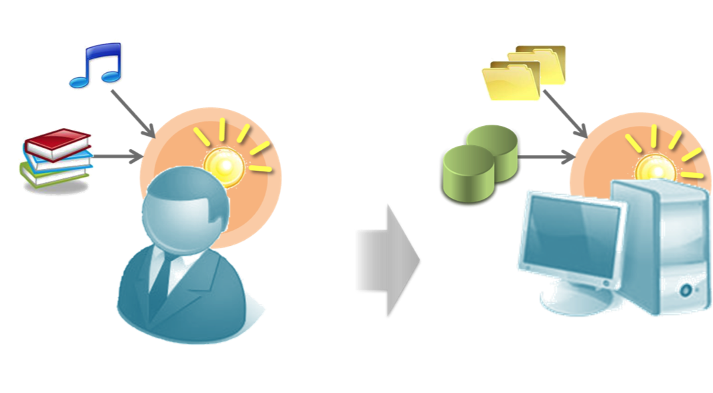

============
Introduction
============

In this section we briefly introduce machine learning and Jubatus.
Please refer to the references if you need more detailed studies.

Machine learning
================

Machine learning is a generic term, given to a set of algorithms for computers to make predictions and analysis on data.
The key is that machine learning is all depending on the given data.
It also closely relates to other technical fields such as statistics, optimization, pattern recognition, natural language processing, and data mining.

Before machine learning becomes so popular, adaptive decisions by computers were basically made according to a set of rules, which define when and what to do.
Rule-based decisions are very useful since they are easy to implement and easy to understand how and why a decision was made.
For more complex and ambiguous decisions, however, it is hard to derive and maintain a large number of combinations of rules required to find a correct answer by taking into account many conditions and exceptions.
On the other hand, machine learning algorithms generally try to find a model, which corresponds to a selected combinations of rules that are sufficient to reproduce the characteristics of a given dataset.
Especially, when computers can use a variety of input data sources, it is more reasonable and robust to automatically make decisions based only on the data, rather than relying on manual rules.
Thanks to the development of better algorithms and high performance, applications of machine learning are expanding in many fields. It includes, for example, advertisement optimization based on the click-through history of candidate ads, spam filtering based on the past spam e-mails, recommendation in e-commerce based on his/her past purchase behaviors, or fraud detection in credit card usages.

Machine learning involves a lot of problem settings.
In this tutorial we focus on the classification problem, which is one of the most commonly-used machine learning tasks in practice.
The task is to predict a class, for example, YES or NO to each input.
In the training phase, a pair of a data sample and an answer is given to the algorithm.
The algorithm can learn their relationship and tendency on when a sample belongs to a specific class.
After repeating the process for a set of training samples, the obtained model can predict the class, YES or NO, to unseen test samples.

   Comparison between machine learning and human's learning

For example, Bayesian filter, which is known as a basis for spam filtering, is also one of the classification problems.

Since classification is very simple, there are many applications.
The above example with two classes YES and NO is called binary classification problem.
"Spam or ham?", "Male or female?", "Clicked or ignored?", these decisions can be all recognized as a sort of binary classification problem.

When having more than two classes, it is called multiclass classification problem.
For example, whan the goal of a task is to watch a picture of dishes and predict them as French, Italian, or Chinese, it belongs to multiclass classification problems.
The classifier in Jubatus can address the multiclass classification problems, which is a generalization of binary case.
The purpose of this tutorial is to learn how to use the Jubatus' classifier (jubaclassifier).

What is Jubatus?
================

Jubatus is an open source software platform for machine learning, which were originally developed by NTT SIC and Preferred Infrastructure, Inc.
Not only classification, it also supports other machine learning tasks such as regression, recommendation, and anomaly detection.

The main advantage is that Jubatus can work in a distributed environment.
We often have a too large amount of data for machine learning problems.
Jubatus is designed to make the algorithm computation distributed among multiple servers so that it can achieve scale-out for higher throughput by adding more servers.
Though this tutorial do not cover the distributed running, please see and try the examples on the official Web or github.com if you are interested.

The another feature of Jubatus is that it focuses on *online learning* in machine learning algorithms.
Typically, training of machine learning models started after all of the training samples are collected and stored in a place (batch learning).
Recently, on the other hand, many efforts have been done for online learning, which is to receive and process each training sample without storing them.
That's the difference between batch and online learning algorithms.
Though special case for online learning is not required in this tutorial, you might realize its advantage in the future.

.. note::

   In general, online learning tends to be worse than batch learning in terms of prediction accurcy since it can only see a part of the samples at each time. However, thanks to the research progress on online learning algorithms, the difference is becoming smaller and smaller especially when we have enough amount of samples.
