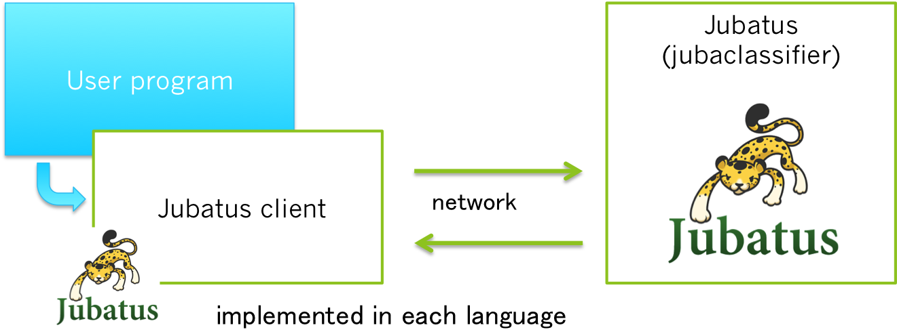

===================
 How to use Jubatus
===================

We will show you how to start and put data into Jubatus, using an example of source code.

Starting Jubatus
================

First, we start running Jubatus.
As we described in the previous section, Jubatus has a set of learners for machine learning tasks.
This time we will use the classifier for classification problem.
For each learner, Jubatus provides different command to start.
Classifier will be run with ``jubaclassifier``.

Here is the simple command to run it.

::

  $ jubaclassifier
  can't start standalone mode without configpath specified
  usage: jubaclassifier [options] ... 
  options:
  ...

Oops, you need to specify an option.
Run the following command again on your terminal.

::

  $ jubaclassifier -f /opt/jubatus/share/jubatus/example/config/classifier/pa1.json

.. note::

   For the older versions of Jubatus than 0.4.0, configuration file is given after started. For later versions, you need it at the start.

The path for option ``-f`` is to a configuration file.
``/opt/jubtus/share/jubatus/`` is the installation path of Jubatus and you have a sample configuration file ``pa1.json`` under it for ``jubaclassifier``.
We will explain what is in the configuration in the next section.
If you have any error message after this command, Jubatus has started successfully. Congratulations!

If it fails, the most possible cause is that other process already occupies the same port, of which default value for ``jubaclassifier`` is 9199.
To change the port number, use option ``-p``.

::

  $ jubaclassifier -f /opt/jubatus/share/jubatus/example/config/classifier/pa1.json -p 19199

Now ``jubaclassifier`` is running and waiting for queries (requests) of training or prediction from clients.

Try example
===========

Next we will run an example of client program to send queries to the running ``jubaclassifier``.
A set of Jubatus examples have been released under the ``jubatus-example`` repository on Github.

https://github.com/jubatus/jubatus-example

From the repository, we choose the simplest one, gender estimation.
In the VM environment, you have the codes under the directory ``~/jubatus-example/gender``.
The task of this example is to estimate the gender of a person based on his/her profile, such as hair-style, uppder body cloth, lower body cloth, and height.
We train a classifier by using a training set of people of which gender information are given.
When running the example script, the queries for training and prediction will be sent to the ``jubaclassifier`` that started above.

OK, let's try to do it. In the folowing, we mainly use Python for the instruction. Note that they are almost the same for those of other languages, except you need to compile the code for C++ and Java.
The ``jubaclassifier`` server process must run as a background job, since we also run a client program.

::

  % cd jubatus-example/gender/python
  % ./gender.py
  female 0.473417669535
  male 0.388551652431
  
  female 2.79595327377
  male -2.36301612854

Did you get an output like this? You got it!

Client-server architecture
==========================

We would like to introduce the architecture of Jubatus by explain how the example works.
Jubatus mainly consists of the server programs for each machine learning tasks such as ``jubaclassifier`` and client programs.
Thanks to this standard server-client architecture, Jubatus achieves both high perforhamce and usability at the same time.
Developers can implement all kinds of data pre-processing and machine learning algortihms on server side with C++, and users can choose the language for their client programs from C++, Java, Python or Ruby.

   The client-server architecture inside Jubatus.

For the communication between servers and clients, we use *msgpack-rpc*, an RPC library based on a format for data seriarlization named *msgpack*.
Users do not need to realize what kind of protocol is used, since client libraries for each languages mask the underlying communication logics.
The only thing to do for users is to use the APIs in the client libraries with specifying the setting. Then the client libraries work as a proxy to the server programs, send queries to them, and obtain the results back to users.

Understand how example works
============================

You already suceeded in running a Jubatus example.
Next, I suppose that you want to know how to modify and expoint the example code in your own programs.
The best way to do it is, as always, to read the example code and understand what it is doing.
Here we use the Python code for explanation. Again note that the examples of other languages have similar structures.

::

   client = jubatus.Classifier(host, port, name)

First we create a client object.
The parameters are the host name of the server process, its port number to communicate, and the name of jubatus cluster.
Each client library of Jubatus includes this kind of client object.
User programs always use any capabilities of Jubatus through this client object.

We briefly explain the training phase in general machile learning algorithms, since a classifier needs to be trained first.
For training a classifier, you need to input *training data* , a set of pairs of data samples and their true classes, which describe "this kind of data samples should be classified into this class." for all of the predefined classes.
Training data is also called as *labeled data* .
We provide the training data at the first line for tranining, by calling ``train`` method of ``jubaclassifier``.
This method is to build or update a classifier based on the tranining data.
The classifier, in general, tries to learn what kind of data is related to each class.

Note that the data structure of the input to ``train`` tends to be complex.
This issue will be fixed in the future version.
We make an instance of  ``datum`` class (struct in C++) as follows.

::

  datum({'hair': 'short', 'top': 'sweater', 'bottom': 'jeans', 'height': 1.70})

We describe this command one-by-one.
``datum`` object is a training data sample. Its constructor method takes two parameters, one for string-type features and another for numerical-type features.
Its constructor takes a map.
Each key of this map must be a string, and each value must be a string or a number.
This map is regarded as a mapping from keys to values.
For example, ``'hair': 'short'`` means that ``hair`` of this person is ``short``.
It is also the same for numerical-type features, as ``'height': 1.70`` shows that the ``height`` is ``1.70``.
Note that we do not any collection structure such as hash or dictionary so far, though it might be more useful.

After finishing the training phase, we use the trained classifeir for prediction of the classes of other data samples of which classes are unknown.
``classify`` method is for classifying new data samples, based on the classification criteria in the classifier,
You need to input a list of ``datam`` to ``classify`` method.
For network communication efficiency, you can input multiple new samples at the same time, though the prediction will be independently done.

The result of predictions will be given as a list object of ``classification_result`` class.
``classification_result`` has a set of pairs of member variables, ``label`` and ``score``.
``label`` corresponds to a class, and ``score`` corresponds to the possiblity tat the data sample belongs to the class.
The ``label`` with the maximum value for ``score`` is the predicted class of Jubatus.
Since the list is NOT sorted, you have to sort the result with ``score`` to find the predicted ``label``.
In the example, we show every pair of ``lbel`` and ``score`` in the standard output.
In the output shown above, since the first and second data samples are for male and for female, respectively, the prediction was woring with the first one.

.. note::

   Since the list is NOT sorted, you have to sort the result with ``score`` to find the predicted ``label``.
   Though higher score corresponds to higher possibility, the value DO NOT represent the probability, so it can be negative value, or more than 1.0.
   

Modify example
==============

By modifying the example code, you can learn the sense of how to use Jubatus.
The simplest way is to add more training data as follows.
In general, more training samples leads to better accuracy in prediction.

::

   train_data = [
       ('male',   Datum({'hair': 'short', 'top': 'sweater', 'bottom': 'jeans', 'height': 1.70})),
       ('female', Datum({'hair': 'long',  'top': 'shirt',   'bottom': 'skirt', 'height': 1.56})),
       ('male',   Datum({'hair': 'short', 'top': 'jacket',  'bottom': 'chino', 'height': 1.65})),
       ('female', Datum({'hair': 'short', 'top': 'T shirt', 'bottom': 'jeans', 'height': 1.72})),
       ('male',   Datum({'hair': 'long',  'top': 'T shirt', 'bottom': 'jeans', 'height': 1.82})),
       ('female', Datum({'hair': 'long',  'top': 'jacket',  'bottom': 'skirt', 'height': 1.43})),
       # Adding these two lines
       ('male',   Datum({'hair': 'short', 'top': 'jacket',  'bottom': 'jeans', 'height': 1.76})),
       ('female', Datum({'hair': 'long',  'top': 'sweater', 'bottom': 'skirt', 'height': 1.52})),
       ]

Then, run the experiment again after restarting ``jubaclassifier`` to clear the old classifier.
This time, we obtain the correct predictions for both test samples.

::

  % ./gender.py
  female -2.1826915741
  male 3.04466104507
  
  female 1.44372224808
  male -1.01078510284

You might expect that adding samples always improves the classifier performance.
However, noisy training example can actually decrese accuracy.

Next, we will add another classes for prediction, rather than only two classes, ``male`` and ``female``.
We define four classes, ``male (child)``, ``male (adult)``, ``female (child)``, and ``female (adult)`` as follows.

::

  train_data = [
    ('male (child)',   datum({'hair': 'short', 'top': 'sweater', 'bottom': 'jeans', 'height': 1.70}),
    ('female (adult)', datum({'hair': 'long',  'top': 'shirt',   'bottom': 'skirt', 'height': 1.56}),
    ('male (child)',   datum({'hair': 'short', 'top': 'jacket',  'bottom': 'chino', 'height': 1.65}),
    ('female (adult)', datum({'hair': 'short', 'top': 'T shirt', 'bottom': 'jeans', 'height': 1.72}),
    ('male (adult)',   datum({'hair': 'long',  'top': 'T shirt', 'bottom': 'jeans', 'height': 1.82}),
    ('female (child)', datum({'hair': 'long',  'top': 'jacket',  'bottom': 'skirt', 'height': 1.43}),
    ('male (adult)',   datum({'hair': 'short', 'top': 'jacket',  'bottom': 'jeans', 'height': 1.76}),
    ('female (child)', datum({'hair': 'long',  'top': 'sweater', 'bottom': 'skirt', 'height': 1.52}),
    ]

Then repreat the experiment again.

::

  % ./gender.py
  female (child) -0.561563551426
  male (adult) 3.46452975273
  male (child) -1.48015928268
  female (adult) -0.560837566853
  
  female (child) 1.72715175152
  male (adult) 0.318117439747
  male (child) -1.42341578007
  female (adult) -0.188916295767

Note that the accuracy is lower since the classificaiton must be more difficult with more candidate classes.

