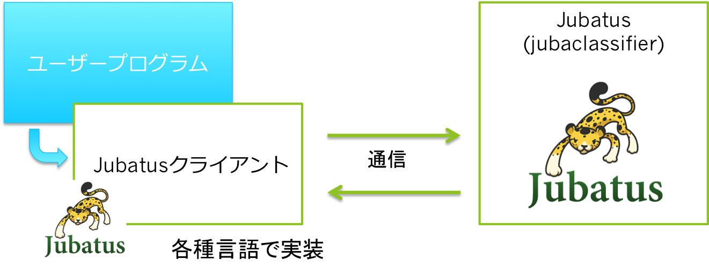

=====================
 Jubatusを使ってみる
=====================

まずはJubatusを起動して、実際にデータを流すところまで手を動かしてみましょう。
サンプルソースを読み解きながら、どのように使えば良いのかを解説します。

Jubatusを起動する
=================

ではJubatusを起動します。
先ほど説明した通り、Jubatusは複数の機械学習器を持っています。
今日使うのは、分類器(classifier)です。
Jubatusは機械学習器ごとに異なるコマンドで起動します。
分類器は ``jubaclassifier`` コマンドです。

分類器を起動してみましょう。

::

  $ jubaclassifier
  can't start standalone mode without configpath specified
  usage: jubaclassifier [options] ... 
  options:
  ... [略]

Jubatusの各サーバーの起動には、設定ファイルを指定する必要があります。
ターミナルから以下のコマンドを叩いてみてください。

::

  $ jubaclassifier -f /opt/jubatus/share/jubatus/example/config/classifier/pa1.json

.. note::

   0.4.0以前までは、起動後に設定を読み込ませていましたが、0.4.0以降では起動時に指定する必要があります。

``-f`` で指定しているのは設定ファイルです。
デフォルトでサンプルの設定が配布されているので、そのサンプル設定を読み込ませています。
設定に関しては、次の章で解説します。
上記のコマンドでエラーが表示されなければjubaclassifierが起動しています。

起動しなかった場合は、別のプロセスが ``jubaclassifier`` のデフォルトポート9199を利用している可能性があります。
利用するポートを変えるときは、 ``-p`` オプションを指定します。

::

  $ jubaclassifier -f /opt/jubatus/share/jubatus/example/config/classifier/pa1.json -p 19199

``jubaclassifier`` は学習や予測のクエリ（リクエスト）を受け取るまで、起動した状態で待機します。

サンプルを実行する
==================

``jubaclassifier`` が起動した状態で、サンプルプログラムを実行してみます。
Jubatusを利用したサンプルアプリケーションを jubatus-example というプロジェクト下で公開しています。

https://github.com/jubatus/jubatus-example

今回はこの中から最も簡単なサンプルである性別推定（gender）を使います。
配布したVMでは、 ``~/jubatus-example/gender`` にあります。
このサンプルは、人の特徴情報（髪型、上半身の服装、下半身の服装、身長）の情報から、男女のいずれかを予測させるサンプルになっています。
各特徴情報と、それがどちらの性別かがわかっているデータを使って学習を行い、性別が未知の人物の特徴情報に対して予測を行います。
実行すると先ほどの ``jubaclassifier`` へ学習や予測のリクエスト（クエリー）を送信します。
では、実行してみましょう。
以降の説明では、 Python の例を利用する前提で書いていきますが、それ以外の言語のサンプルを利用しても説明は概ね同じです。
C++やJavaの場合は、ビルドしてから利用してください。
先ほど起動させたサーバーと、これから起動させるクライアントの2つを動かす必要があるので、サーバーをバックグラウンドジョブで動かすなどしてください。

::

  % cd jubatus-example/gender/python
  % ./gender.py
  female 0.473417669535
  male 0.388551652431
  
  female 2.79595327377
  male -2.36301612854

上記のような出力が出たら成功です。

サーバー・クライアントモデル
============================

先のプログラムがどのように動いているのかを通じて、Jubatusの仕組みを解説します。
Jubatusは最初に実行した ``jubaclassifier`` をはじめとするサーバーと、サンプルプログラムを始めとするクライアントからなります。
この仕組みのお陰で、C++で書かれたサーバーがデータの前処理から各種機械学習アルゴリズムの適用を担当し、一方ユーザーサイドのクライアントはPythonやJavaなどの複数の言語のものから選択できます。

   Jubatusサーバーとクライアントの構成。

クライアントとサーバー間の通信は、 *msgpack* というデータシリアライズ形式を使った *msgpack-rpc* を利用しています。
各言語用のクライアントライブラリは、msgpack-rpcをラップして隠蔽しているため、ユーザーは何の通信プロトコルを利用しているか知る必要はありません。
クライアントライブラリで用意されているメソッドを呼び出すだけで、自動的に通信を行い、分析結果が得られます。

サンプルプログラムを読んでみる
==============================

ここから自分でプログラムを書けるようにしていきます。
まず手始めに、サンプルプログラムを読んでみます。
非常に単純なサンプルです。

ここでは Python のソースをベースに説明します。
他の言語のサンプルも概ね同じような構造をしています。

::

   client = jubatus.Classifier(host, port, name)

最初にclassifierのクライアントオブジェクトを作成します。
引数に渡しているのは、サーバーのホスト名とポート番号、それからJubatusのクラスター名です。
いずれの言語のライブラリにも、同様なクライアントオブジェクトが存在します。
Jubatusは常にクライアントオブジェクト経由で利用します。

分類器では、まず学習を行いますが、それに関して簡単に説明します。
分類器の学習には、「このデータはこの分類がされます」という *教師データ* を与える必要があります。
教師データは *正解データ* 、 *ラベル付きデータ* と呼ばれることもあります。
最初の行で用意しているのが、この教師データです。
教師データを使って、 ``jubaclassifier`` の ``train`` メソッドを呼び出しています。
``train`` メソッドは、教師データを与えて分類器の構築あるいは更新を行うためのメソッドです。
概ね内部では、「どのようなデータがどのように分類されるのか」という傾向を学習していることになります。

余談ですが ``train`` に渡すデータ構造が複雑なので注意してください。
これは将来的にはもっと使いやすい形になる予定です。
``datum`` というクラス（C++なら struct）のインスタンスを作っています。
以下のようになっているかとおもいます。

::

  datum({'hair': 'short', 'top': 'sweater', 'bottom': 'jeans', 'height': 1.70})

ちょっとわかりにくいので、分解して説明します。
``datum`` は単一の教師データを表します。
コンストラクタで1つのマップを渡します。
キーは必ず文字列で、値には文字列か数値を指定できます。
キーと値のマッピングとして解釈されます。
例えば、 ``'hair': 'short'`` は ``'hair'`` （髪）が ``'short'`` （短髪）である、という風に読んでください。
``'height': 1.70`` となっていれば、 ``'height'`` （身長）が ``1.70`` である、という意味です。
PythonやRubyなど、マップ形式のデータ構造を記述しやすい言語では、マップ型で指定できますが、C++やJavaでは難しいです。
そのため、メソッドを利用してこのデータ構造を構築します。
具体的にはそれぞれのソースを参照して下さい。

学習のステップが終わったら、その学習済み分類器を使って未分類のデータを自動分類しています。
``classify`` メソッドは、未分類のデータを分類するためのメソッドです。
今まで学習したデータの傾向に照らしあわせて、学習された基準によって分類を行います。
``classify`` メソッドには、 ``datum`` のリストを渡します。
なお、通信コストを下げるためにリスト形式で一度に複数のデータを渡すようになっています。

それぞれの分類結果は ``classification_result`` という型のリスト形式で返ってきます。
``classification_result`` には ``label`` というメンバ変数と ``score`` というメンバ変数が含まれます。
前者は予測したラベル、後者はそれに対するスコアを示します。
スコアが最大のラベルが、システムの予想だと考えてください。
ソートされて出力されるわけではないので、スコア最大のラベルを探すのは自分でソートする必要があります。
サンプルでは、システムの返した  ``.label`` と ``.score`` を全て出力してます。
1つ目のデータは男性を、2つ目のデータは女性を想定していますから、1つ目のデータに対する分類に失敗しています。

.. note::

   生の結果が返ってきますから、スコアが最大のラベルを探すのはユーザー側で行う必要があります。
   また、スコアは例えば 0 から 1 の間に収まるスコアが出るわけではありません。
   負になることも、数万になることもありますので注意してください。

サンプルを改造してみる
======================

サンプルプログラムの改造を通して、使い方の感触を得ましょう。
一番簡単な改良として、学習データを増やしてみます。
一般的に、学習データは大量にあったほうが分類精度は良くなります。
以下のように、学習データを増やしてみます。

::

   train_data = [
       ('male',   Datum({'hair': 'short', 'top': 'sweater', 'bottom': 'jeans', 'height': 1.70})),
       ('female', Datum({'hair': 'long',  'top': 'shirt',   'bottom': 'skirt', 'height': 1.56})),
       ('male',   Datum({'hair': 'short', 'top': 'jacket',  'bottom': 'chino', 'height': 1.65})),
       ('female', Datum({'hair': 'short', 'top': 'T shirt', 'bottom': 'jeans', 'height': 1.72})),
       ('male',   Datum({'hair': 'long',  'top': 'T shirt', 'bottom': 'jeans', 'height': 1.82})),
       ('female', Datum({'hair': 'long',  'top': 'jacket',  'bottom': 'skirt', 'height': 1.43})),
       # 下の2行を追加
       ('male',   Datum({'hair': 'short', 'top': 'jacket',  'bottom': 'jeans', 'height': 1.76})),
       ('female', Datum({'hair': 'long',  'top': 'sweater', 'bottom': 'skirt', 'height': 1.52})),
       ]

もう一度同じようにサンプルを実行してください。
実験を繰り返すときは、 ``jubaclassifier`` の再起動もしましょう。
そのまま実行すると、追加学習になります。
実行すると正しく分類できるようになりました。

::

  % ./gender.py
  female -2.1826915741
  male 3.04466104507
  
  female 1.44372224808
  male -1.01078510284

学習データは増やせば増やすほど、基本的には分類精度の向上が期待されます。
ただし、追加したデータが今までと違う傾向があったりすると、精度が向上するどころか下がることもあるので注意しましょう。

次に、ラベルを追加してみます。
今まで"男"と"女"だけの分類でしたが、"男（大人）", "女（大人）", "男（子供）", "女（子供）"の4分類にしてみます。

::

  train_data = [
    ('male (child)',   datum({'hair': 'short', 'top': 'sweater', 'bottom': 'jeans', 'height': 1.70}),
    ('female (adult)', datum({'hair': 'long',  'top': 'shirt',   'bottom': 'skirt', 'height': 1.56}),
    ('male (child)',   datum({'hair': 'short', 'top': 'jacket',  'bottom': 'chino', 'height': 1.65}),
    ('female (adult)', datum({'hair': 'short', 'top': 'T shirt', 'bottom': 'jeans', 'height': 1.72}),
    ('male (adult)',   datum({'hair': 'long',  'top': 'T shirt', 'bottom': 'jeans', 'height': 1.82}),
    ('female (child)', datum({'hair': 'long',  'top': 'jacket',  'bottom': 'skirt', 'height': 1.43}),
    ('male (adult)',   datum({'hair': 'short', 'top': 'jacket',  'bottom': 'jeans', 'height': 1.76}),
    ('female (child)', datum({'hair': 'long',  'top': 'sweater', 'bottom': 'skirt', 'height': 1.52}),
    ]

先程と同様に実行してみましょう。

::

  % ./gender.py
  female (child) -0.561563551426
  male (adult) 3.46452975273
  male (child) -1.48015928268
  female (adult) -0.560837566853
  
  female (child) 1.72715175152
  male (adult) 0.318117439747
  male (child) -1.42341578007
  female (adult) -0.188916295767

一般的にラベル数を増やせば増やすほど、見かけ上の精度は下がることに注意しましょう。
分類の粒度が細かくなればなるほど、正しく当てるのが難しくなるためです。

